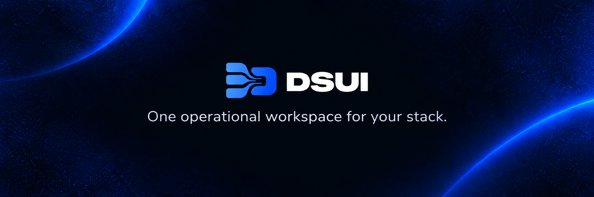
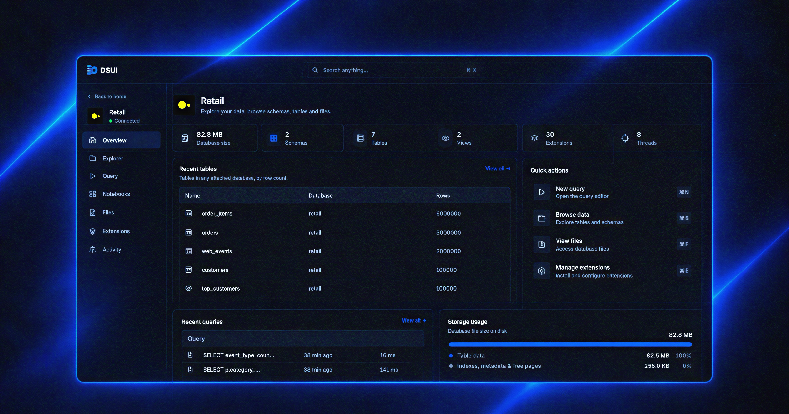

[Website](https://dsui.northgraindata.com) · [Docs](https://dsui.northgraindata.com/docs) · [GitHub](https://github.com/northgraindata/dsui)

# One operational workspace for your stack.

Connect, explore and operate the data and infrastructure tools you already run.




## Spend less time setting up tooling

A data stack can mean a separate interface, container, configuration, and port for every service. DSUI gives the tools you already run one consistent workspace.

## Get started

Run DSUI on your host for local development and project files:

```bash
npx @northgraindata/dsui
```

DSUI loads `./dsui.yaml` when present and keeps local state in
`~/.local/share/dsui`.

## Docker deployment

Use Docker when you want an isolated, reproducible deployment. It connects to
services reachable from the container. If an adapter requires an executable or
runtime, provide it in the image used to run DSUI.

## One setup, across your stack

Configure a DuckDB database in `dsui.yaml`:

```yaml
services:
  - id: warehouse
    adapter: duckdb
    name: Analytics warehouse
    connection:
      method: file
      path: /data/warehouse.duckdb
```

Run DSUI alongside it in `docker-compose.yml`:

```yaml
services:
  dsui:
    image: ghcr.io/northgraindata/dsui:latest
    ports:
      - "4192:4192"
    environment:
      DSUI_CONFIG: /etc/dsui/dsui.yaml
    volumes:
      - ./dsui.yaml:/etc/dsui/dsui.yaml:ro
      - dsui-data:/data

volumes:
  dsui-data:
```

Start the workspace:

```bash
docker compose up -d
```

Open [http://localhost:4192](http://localhost:4192). DSUI loads its bundled DuckDB adapter and opens the database file in the persistent `/data` volume. Add your other services to the same `dsui.yaml` and Compose network.

## Adapters

Connect Apache Airflow, dbt, PostgreSQL, Trino, S3-compatible storage such as MinIO, and DuckDB through one workspace.


|                                                       |                                               |                                                             |                                                       |                                                   |                                                |                                                         |
| ----------------------------------------------------- | --------------------------------------------- | ----------------------------------------------------------- | ----------------------------------------------------- | ------------------------------------------------- | ---------------------------------------------- | ------------------------------------------------------- |
|  |  |  |  |  |  |  |


**Need another tool?**
The TypeScript [Adapter SDK](https://dsui.northgraindata.com/docs/adapter-sdk) lets you bring internal services and community adapters into the same workspace.

DSUI runs in your environment and keeps its local state in `/data`. It does not need a separate database or control plane. The official container image is published through GitHub Container Registry:

```bash
docker pull ghcr.io/northgraindata/dsui:latest
```

## Contributing

Contributions are welcome. See `[CONTRIBUTING.md](./CONTRIBUTING.md)` to get started.

## License

DSUI is developed by [Northgrain Data](https://northgraindata.com) and is available under the [Apache License 2.0](./LICENSE).
