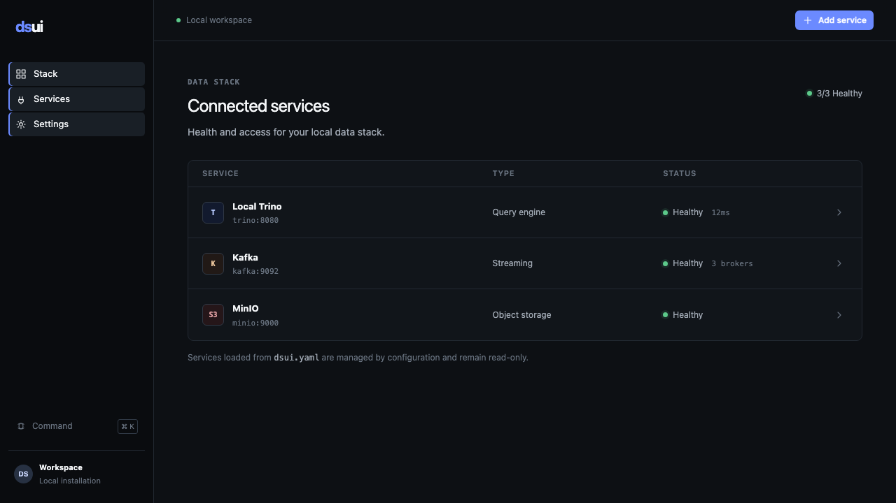

<p align="center">
  <strong>dsui</strong><br />
  <sub>DATA STACK UI</sub>
</p>

<p align="center"><strong>One lightweight UI for your data stack.</strong></p>

<p align="center">
  <a href="https://github.com/northgraindata/dsui/actions/workflows/ci.yml"></a>
  <a href="https://github.com/northgraindata/dsui/releases"></a>
  <a href="LICENSE"></a>
  <a href="https://github.com/northgraindata/dsui/pkgs/container/dsui"></a>
</p>



dsui is an open-source, local-first interface for inspecting Trino, Kafka, S3, MinIO, and future data services from one place. It replaces the extra UI container normally added for each service in a development stack.

## Quickstart

```bash
docker run --rm -p 3000:3000 -v dsui-data:/data \
  ghcr.io/northgraindata/dsui:latest
```

Open `http://localhost:3000` and add a service, or mount a declarative `dsui.yaml`. The complete demo is in [`examples/data-stack`](examples/data-stack).

```bash
docker compose -f examples/data-stack/compose.yaml up --build
```

## Why dsui

A Compose data stack can already include a query engine, broker, object store, database, and stream processor. Running a separate administration UI for each one adds memory, images, ports, and context switching. dsui covers the common developer workflows through one server-side adapter model and one compact interface.

It is not a data platform, orchestrator, observability suite, catalog, SaaS control plane, or replacement for every vendor-specific console.

## Supported services

| Adapter | Workflows | Status |
| --- | --- | --- |
| Trino | Queries, catalogs, schemas, tables | Available |
| Kafka | Topics, messages, offsets, consumer groups | Available |
| S3 / MinIO | Buckets, objects, metadata, downloads | Available |
| PostgreSQL | Tables, schemas, queries | Planned |
| Flink | Jobs and service information | Planned |

## Lightweight by design

dsui uses Bun, Hono, SQLite, Vite, and a small set of focused dependencies. It does not require PostgreSQL, Redis, an external control plane, or a dsui account. CI records image size, idle memory, cold startup, and frontend bundle size; benchmark values are published only after they are measured.

## Docker Compose

```yaml
services:
  dsui:
    image: ghcr.io/northgraindata/dsui:latest
    ports:
      - "3000:3000"
    volumes:
      - ./dsui.yaml:/etc/dsui/dsui.yaml:ro
      - dsui-data:/data
```

Configuration-managed services are read-only in the UI. `${ENV_NAME}` interpolation keeps credentials out of committed YAML, and resolved secrets never reach browser storage.

## Adapters

The core application contains no Trino, Kafka, or S3-specific UI logic. Adapters declare connection fields, health, operations, capabilities, and validated views rendered by dsui. Community adapters can be installed from exact, integrity-pinned npm packages or exact GitHub commits; adapter-supplied browser code is not accepted.

Start with [`templates/adapter`](templates/adapter) and the [Adapter SDK guide](https://dsui.northgraindata.com/docs/adapter-sdk/). The pre-1.0 API is intentionally experimental until all three built-in adapters have exercised it.

## Documentation

Practical installation, configuration, adapter, CLI, architecture, and security documentation lives at [dsui.northgraindata.com/docs](https://dsui.northgraindata.com/docs/).

## Contributing

Read [CONTRIBUTING.md](CONTRIBUTING.md). Focused issues and pull requests are welcome, especially adapter implementations, contract tests, accessibility improvements, and measured performance work.

## Northgrain Data

Built and maintained by [Northgrain Data](https://northgraindata.com). dsui has its own project identity; Northgrain attribution is intentionally secondary.

## License

Licensed under the [Apache License 2.0](LICENSE).
