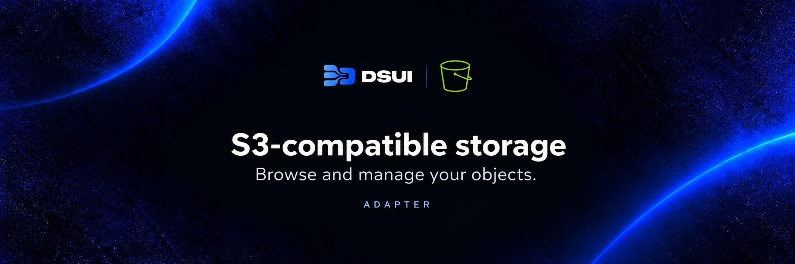

[Adapter SDK](../adapter-sdk) · [Source](./src/adapter.ts) · [DSUI](../../README.md)

# S3-compatible storage adapter

Browse and manage AWS S3 or S3-compatible object storage, including MinIO, from DSUI.

Package: `@northgraindata/dsui-adapter-s3`. This is currently a private workspace package.

## Capabilities

- Browse buckets, prefixes, objects and object metadata.
- Preview objects and inspect versions.
- Upload, copy, move and delete objects.

## Configure

This example uses the local adapter source from a repository checkout. Run DSUI from the repository root for these relative paths, or use absolute paths for your deployment.

```yaml
adapters:
  s3:
    source: local
    path: ./packages/adapter-s3

services:
  - id: s3-example
    adapter: s3
    name: S3-compatible storage
    connection:
      method: s3
      region: us-east-1
      endpoint: http://localhost:9000
      forcePathStyle: true
      accessKeyId: "${S3_ACCESS_KEY_ID}"
      secretAccessKey: "${S3_SECRET_ACCESS_KEY}"
```

Secret placeholders are expanded from the DSUI process environment.

## Connection notes

- Omit `endpoint` for AWS S3; custom endpoints can use `forcePathStyle: true`.
- The endpoint must be reachable from DSUI. `publicEndpoint` can specify a separate endpoint for browser-facing URLs.
- Bucket discovery uses the configured credentials. Reads and mutations require the corresponding storage permissions.

See the [connection definitions](./src/context.ts) and [adapter registration](./src/adapter.ts) for the complete current contract.

## Development

Run from the repository root after installing dependencies:

```sh
bun run --filter @northgraindata/dsui-adapter-s3 test
bun run --filter @northgraindata/dsui-adapter-s3 typecheck
```

See [CONTRIBUTING.md](../../CONTRIBUTING.md) for repository checks.

## License

[Apache License 2.0](../../LICENSE), developed by [Northgrain Data](https://northgraindata.com).
